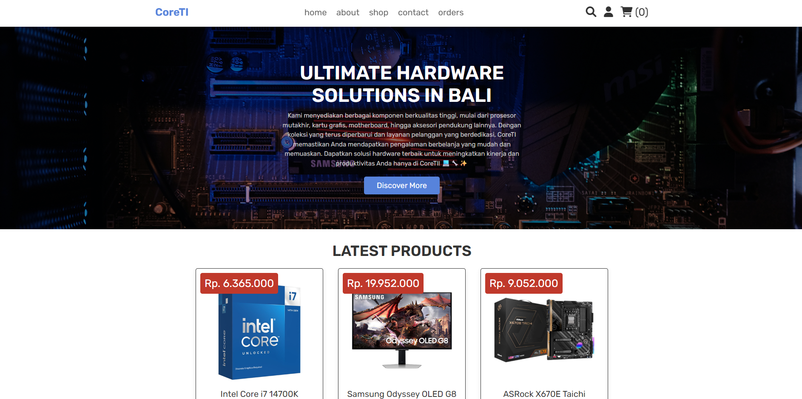

# CoreTI - E-commerce Hardware Store

Modern PHP e-commerce application for computer hardware sales in Bali.



## Directory Structure

```
CoreTI/
├── public/                     # Web root (document root)
│   ├── index.php               # Front controller
│   ├── .htaccess               # URL rewriting
│   └── assets/
│       ├── css/                # Stylesheets
│       ├── js/                 # JavaScript files
│       ├── images/             # Static images
│       └── uploads/            # Product images
│
├── app/
│   ├── Core/                   # Framework core classes
│   │   ├── Controller.php      # Base controller
│   │   ├── Database.php        # PDO wrapper
│   │   ├── Router.php          # URL routing
│   │   └── Session.php         # Session management
│   │
│   ├── Controllers/
│   │   ├── Customer/           # Customer controllers
│   │   │   ├── AuthController.php
│   │   │   ├── HomeController.php
│   │   │   ├── ShopController.php
│   │   │   ├── CartController.php
│   │   │   ├── CheckoutController.php
│   │   │   ├── OrderController.php
│   │   │   └── ContactController.php
│   │   │
│   │   └── Admin/              # Admin controllers
│   │       ├── DashboardController.php
│   │       ├── ProductController.php
│   │       ├── OrderController.php
│   │       ├── UserController.php
│   │       └── MessageController.php
│   │
│   ├── Models/                 # Data models
│   │   ├── User.php
│   │   ├── Product.php
│   │   ├── Cart.php
│   │   ├── Order.php
│   │   └── Message.php
│   │
│   ├── Views/
│   │   ├── customer/           # Customer views
│   │   └── admin/              # Admin views
│   │
│   └── Helpers/
│       └── functions.php       # Helper functions
│
├── config/
│   ├── app.php                 # App configuration
│   ├── database.php            # Database configuration
│   └── routes.php              # Route definitions
│
└── database/
    └── shop_db.sql             # Database schema
```

## Features

- Modular MVC Architecture
- PDO Database Layer with prepared statements
- Session Management with flash messages
- CSRF Protection
- Password hashing with bcrypt
- Admin Panel (Dashboard, Products, Orders, Users, Messages)
- Customer Area (Shop, Cart, Checkout, Orders, Contact)
- Responsive Design

## Installation

### 1. Setup Database

Buat database `shop_db` di phpMyAdmin/HeidiSQL, lalu import:

```sql
-- Import file: database/shop_db.sql
```

### 2. Configure App URL

Edit `config/app.php` sesuai environment:

```php
return [
    'name' => 'CoreTI',
    'url' => 'http://localhost:8080/CoreTI/public',  // Sesuaikan
    'timezone' => 'Asia/Makassar',
    'debug' => true,
    'max_upload_size' => 2097152,
    'allowed_extensions' => ['jpg', 'jpeg', 'png', 'gif', 'webp']
];
```

### 3. Configure Database

Edit `config/database.php`:

```php
return [
    'host' => 'localhost',
    'database' => 'shop_db',
    'username' => 'root',
    'password' => '',
    'charset' => 'utf8mb4'
];
```

### 4. Copy Assets

```cmd
cd C:\laragon\www\CoreTI
mkdir public\assets\images
mkdir public\assets\uploads
xcopy images\* public\assets\images\ /E /Y
xcopy uploaded_img\* public\assets\uploads\ /E /Y
```

### 5. Access Application

```
http://localhost:8080/CoreTI/public/
```

## URL Routes

### Customer Routes

| URL         | Description     |
| ----------- | --------------- |
| `/`         | Login page      |
| `/login`    | Login           |
| `/register` | Registration    |
| `/home`     | Home page       |
| `/shop`     | Product listing |
| `/search`   | Search products |
| `/cart`     | Shopping cart   |
| `/checkout` | Checkout        |
| `/orders`   | Order history   |
| `/about`    | About page      |
| `/contact`  | Contact form    |
| `/logout`   | Logout          |

### Admin Routes

| URL                        | Description        |
| -------------------------- | ------------------ |
| `/admin`                   | Dashboard          |
| `/admin/products`          | Product management |
| `/admin/products/add`      | Add product        |
| `/admin/products/edit/{id}`| Edit product       |
| `/admin/products/delete/{id}` | Delete product  |
| `/admin/orders`            | Order management   |
| `/admin/users`             | User management    |
| `/admin/messages`          | Message management |

## Security Features

- **Password Hashing**: bcrypt via `password_hash()`
- **SQL Injection Prevention**: PDO prepared statements
- **XSS Protection**: Output escaping with `htmlspecialchars()`
- **CSRF Protection**: Token validation on forms
- **Session Security**: Regenerate session ID on login

## Requirements

- PHP 8.0+
- MySQL 5.7+ / MariaDB 10.3+
- Apache with mod_rewrite enabled

## Authors

Nata & Gusde

## License

© 2024 CoreTI. All rights reserved.
